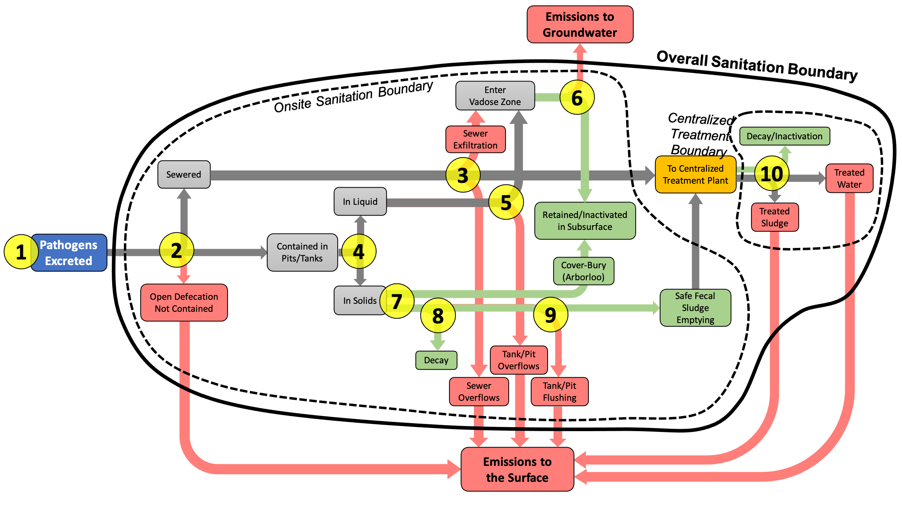

## Installation

The latest version of `pathogenflows` can be installed from github (if you don't have the package **devtools**, you will need to install it first):

``` r
# install.packages("devtools")
devtools::install_github('mverbyla/pathogenflows')
```

## About

The `pathogenflows` package contains two functions that can be used to predict pathogen flows throughout sanitation systems.

The `getLoadings` function allows you to predict annual loadings of water pathogens from onsite sanitation system technologies used in a given region of the world. 

The `getLRV` function allows you to predict the overall log<sub>10</sub> reduction value for viral, bacterial, protozoan, or helminth pathogens by a custom wastewater treatment plant, specified using the [K2P Sketcher Tool](http://tools.waterpathogens.org/sketcher/).

## getLoadings

### Inputs:

The `getloadings` function requires the following two inputs:
*   onsiteData
*   pathogenType

The input `onsiteData` should refer to the web address of a data input file from the K2P Data Portal (data.waterpathogens.org). This file must be in a very specific format. An example file can be found [here](http://data.waterpathogens.org/dataset/5374462b-5bb5-456f-bfc0-816ea572666d/resource/4d9e5fba-9280-4b8b-acce-d1c87952acc1/download/onsitedata_example.csv).

The input `pathogenType` should be equal to either one of the following strings: `c("Virus","Bacteria","Protozoa","Helminth")`. 

### Outputs:

The function outputs a list with a dataframe for each `subregion`, where each subregion's dataframe contains the following estimated annual loadings and calculated reduction values:

| Variable | Pathogen Loadings               | Description          |
|:-----|:--------------------------|:---------------------------|
| `subregion`  | Subregion                       | The subregion of interest   |
| `id`  | ID                       | String ID for the sanitation technology category   |
| `sanitationTechnology`  | Sanitation technology                       | A description of the sanitation technology   |
| `percentage`  | Percentage                  | Percentage of the population in a subregion using that particular sanitation technology   |
| `excreted`  | Excreted                       | Number of pathogens excreted per year   |
| `toGroundwater`  | To groundwater             | Number of pathogens emitted to groundwater each year   |
| `toSurface`  | To the surface                 | Number of pathogens emitted to the surface each year      |
| `inSubsurface`  | Retained in subsurface    | Number of pathogens retained in the subsurface each year |
| `decayed`  | Decayed/inactivated        | Number of pathogens inactivated per year | 
| `fecalSludge`  | Conveyed in fecal sludge to treatment   | Number of pathogens conveyed each year to treatment in fecal sludge |
| `sewerage`  | Conveyed in sewerage to treatment   | Number of pathogens conveyed each year to treatment in sewerage | 
| `stillViable`  | Still viable  | Total number of pathogens that remain viable (`stillViable + decayed = excreted`)  |
| `onsiteLRV`  | Onsite log reduction value  | The base 10 logarithmic reduction of pathogens achieved by onsite sanitation (`Onsite_LRV = log10(excreted/stillViable)`) |

## getLRV

### Inputs:

The `getLRV` function requires the following two inputs:
*   sketch
*   pathogenType
*   inFecalSludge
*   inSewage

The input `sketch` should refer to a JSON file that describes the wastewater or fecal sludge treatment plant. This file must be in a very specific format. An example file can be found [here](http://data.waterpathogens.org/dataset/a1423a05-7680-4d1c-8d67-082fbeb00a50/resource/e7852e8f-9603-4b19-a5fa-9cb3cdc63bb8/download/sketch_lubigi.json). A file like this can be created using the [K2P Sketcher Tool](http://tools.waterpathogens.org/sketcher/).

The input `pathogenType` should be equal to either one of the following strings: `c("Virus","Bacteria","Protozoa","Helminth")`. 

The input `inFecalSludge` should be a number value that represents the number of pathogens conveyed each year in fecal sludge to the treatment plant. The `getLoadings` function can be used to estimate this value for a given service area of interest, but if this value is unknown, you can just leave it blank and the function will calculate the log reduction value and the relative portion of pathogens discharged in liquid effluent vs. sludge.

The input `inSewage` should be a number value that represents the number of pathogens conveyed each year in fecal sludge to the treatment plant. The `getLoadings` function can be used to estimate this value for a given service area of interest, but if this value is unknown, you can just leave it blank and the function will calculate the log reduction value and the relative portion of pathogens discharged in liquid effluent vs. sludge.

### Outputs:

The function outputs a dataframe with the following values:

`dataframe goes here`



## Examples

Here is an [example output](virus.html).

The following shows the use of the getLoadings function for data from Kampala, Uganda, grouping the data by 'region' and showing results for the 'Virus' group.

``` r
getLoadings(onsiteData,pathogenType="Virus")

> loadings
$Central
                     id                      sanitationTechnology  percentage     excreted toGroundwater    toSurface inSubsurface      decayed  fecalSludge    sewerage  stillViable onsiteLRV
1            flushSewer Flush / pour flush to piped sewer system  0.263426061 9.142680e+15  0.000000e+00 0.000000e+00 0.000000e+00 0.000000e+00 0.000000e+00 9.14268e+15 9.142680e+15      0.00
2           flushSeptic        Flush / pour flush to septic tank  0.202395075 7.023540e+15  5.618832e+14 1.174215e+13 5.056949e+15 1.389521e+15 3.444403e+12 0.00000e+00 5.770698e+14      1.09
3              flushPit        Flush / pour flush to pit latrine  0.057237316 1.987380e+15  1.589904e+14 3.322557e+12 1.430914e+15 3.931788e+14 9.746279e+11 0.00000e+00 1.632876e+14      1.09
4             flushOpen         Flush / pour flush to open drain  0.012221734 4.245600e+14  0.000000e+00 4.245600e+14 0.000000e+00 0.000000e+00 0.000000e+00 0.00000e+00 4.245600e+14      0.00
5          flushUnknown    Flush / pour flush to don't know where 0.007753772 2.708400e+14  0.000000e+00 2.708400e+14 0.000000e+00 0.000000e+00 0.000000e+00 0.00000e+00 2.708400e+14      0.00
6               pitSlab                 Dry pit latrine with slab 0.410974140 1.425936e+16  0.000000e+00 1.191960e+14 0.000000e+00 1.410520e+16 3.496455e+13 0.00000e+00 1.541605e+14      1.97
7             pitNoSlab   Dry pit latrine without slab / open pit 0.024476960 8.491200e+14  0.000000e+00 7.097912e+12 0.000000e+00 8.399400e+14 2.082078e+12 0.00000e+00 9.179989e+12      1.97
8    compostingTwinSlab    Composting toilet - twin pit with slab 0.000000000 0.000000e+00  0.000000e+00 0.000000e+00 0.000000e+00 0.000000e+00 0.000000e+00 0.00000e+00 0.000000e+00       NaN
9  compostingTwinNoSlab Composting toilet - twin pit without slab 0.000000000 0.000000e+00  0.000000e+00 0.000000e+00 0.000000e+00 0.000000e+00 0.000000e+00 0.00000e+00 0.000000e+00       NaN
10     compostingToilet                 Composting toilet - other 0.006835904 2.379000e+14  0.000000e+00 1.988639e+12 0.000000e+00 2.353280e+14 5.833408e+11 0.00000e+00 2.571980e+12      1.97
11        bucketLatrine                             Bucket toilet 0.000000000 0.000000e+00  0.000000e+00 0.000000e+00 0.000000e+00 0.000000e+00 0.000000e+00 0.00000e+00 0.000000e+00       NaN
12       containerBased                Container-based sanitation 0.000000000 0.000000e+00  0.000000e+00 0.000000e+00 0.000000e+00 0.000000e+00 0.000000e+00 0.00000e+00 0.000000e+00       NaN
13        hangingToilet                  Hanging toilet / latrine 0.000000000 0.000000e+00  0.000000e+00 0.000000e+00 0.000000e+00 0.000000e+00 0.000000e+00 0.00000e+00 0.000000e+00       NaN
14       openDefecation                No facility / bush / field 0.011578119 4.026000e+14  0.000000e+00 4.026000e+14 0.000000e+00 0.000000e+00 0.000000e+00 0.00000e+00 4.026000e+14      0.00
15                other                           Other (specify) 0.003100918 1.061400e+14  0.000000e+00 0.000000e+00 0.000000e+00 0.000000e+00 0.000000e+00 0.00000e+00 0.000000e+00       Inf

$Kawempe
                     id                      sanitationTechnology   percentage     excreted toGroundwater    toSurface inSubsurface      decayed  fecalSludge    sewerage  stillViable onsiteLRV
1            flushSewer Flush / pour flush to piped sewer system  0.0368606218 6.738060e+15  0.000000e+00 0.000000e+00 0.000000e+00 0.000000e+00 0.000000e+00 6.73806e+15 6.738060e+15      0.00
2           flushSeptic        Flush / pour flush to septic tank  0.1422744756 2.601162e+16  2.080930e+15 6.090085e+13 1.872837e+16 5.135254e+15 6.169477e+12 0.00000e+00 2.148000e+15      1.08
3              flushPit        Flush / pour flush to pit latrine  0.0576012883 1.052982e+16  8.423856e+14 2.465340e+13 7.581470e+15 2.078813e+15 2.497479e+12 0.00000e+00 8.695365e+14      1.08
4             flushOpen         Flush / pour flush to open drain  0.0016795832 3.074400e+14  0.000000e+00 3.074400e+14 0.000000e+00 0.000000e+00 0.000000e+00 0.00000e+00 3.074400e+14      0.00
5          flushUnknown    Flush / pour flush to don't know where 0.0052484696 9.589200e+14  0.000000e+00 9.589200e+14 0.000000e+00 0.000000e+00 0.000000e+00 0.00000e+00 9.589200e+14      0.00
6               pitSlab                 Dry pit latrine with slab 0.7361309305 1.345855e+17  0.000000e+00 1.575521e+15 0.000000e+00 1.328504e+17 1.596060e+14 0.00000e+00 1.735127e+15      1.89
7             pitNoSlab   Dry pit latrine without slab / open pit 0.0144161741 2.635200e+15  0.000000e+00 3.084889e+13 0.000000e+00 2.601226e+15 3.125105e+12 0.00000e+00 3.397399e+13      1.89
8    compostingTwinSlab    Composting toilet - twin pit with slab 0.0000000000 0.000000e+00  0.000000e+00 0.000000e+00 0.000000e+00 0.000000e+00 0.000000e+00 0.00000e+00 0.000000e+00       NaN
9  compostingTwinNoSlab Composting toilet - twin pit without slab 0.0000000000 0.000000e+00  0.000000e+00 0.000000e+00 0.000000e+00 0.000000e+00 0.000000e+00 0.00000e+00 0.000000e+00       NaN
10     compostingToilet                 Composting toilet - other 0.0003306902 5.856000e+13  0.000000e+00 6.855309e+11 0.000000e+00 5.780502e+13 6.944677e+10 0.00000e+00 7.549776e+11      1.89
11        bucketLatrine                             Bucket toilet 0.0000000000 0.000000e+00  0.000000e+00 0.000000e+00 0.000000e+00 0.000000e+00 0.000000e+00 0.00000e+00 0.000000e+00       NaN
12       containerBased                Container-based sanitation 0.0000000000 0.000000e+00  0.000000e+00 0.000000e+00 0.000000e+00 0.000000e+00 0.000000e+00 0.00000e+00 0.000000e+00       NaN
13        hangingToilet                  Hanging toilet / latrine 0.0001060999 1.830000e+13  0.000000e+00 1.830000e+13 0.000000e+00 0.000000e+00 0.000000e+00 0.00000e+00 1.830000e+13      0.00
14       openDefecation                No facility / bush / field 0.0045986602 8.418000e+14  0.000000e+00 8.418000e+14 0.000000e+00 0.000000e+00 0.000000e+00 0.00000e+00 8.418000e+14      0.00
15                other                           Other (specify) 0.0007456240 1.354200e+14  0.000000e+00 0.000000e+00 0.000000e+00 0.000000e+00 0.000000e+00 0.00000e+00 0.000000e+00       Inf

$Makindye
                     id                      sanitationTechnology   percentage     excreted toGroundwater    toSurface inSubsurface      decayed  fecalSludge    sewerage  stillViable onsiteLRV
1            flushSewer Flush / pour flush to piped sewer system  2.857037e-02 6.042660e+15  0.000000e+00 0.000000e+00 0.000000e+00 0.000000e+00 0.000000e+00 6.04266e+15 6.042660e+15      0.00
2           flushSeptic        Flush / pour flush to septic tank  2.592807e-01 5.484510e+16  4.387608e+15 1.243115e+14 3.948847e+16 1.083015e+16 1.455793e+13 0.00000e+00 4.526477e+15      1.08
3              flushPit        Flush / pour flush to pit latrine  8.254003e-02 1.745820e+16  1.396656e+15 3.957064e+13 1.256990e+16 3.447435e+15 4.634057e+12 0.00000e+00 1.440861e+15      1.08
4             flushOpen         Flush / pour flush to open drain  3.821692e-03 8.088600e+14  0.000000e+00 8.088600e+14 0.000000e+00 0.000000e+00 0.000000e+00 0.00000e+00 8.088600e+14      0.00
5          flushUnknown    Flush / pour flush to don't know where 1.747709e-02 3.696600e+15  0.000000e+00 3.696600e+15 0.000000e+00 0.000000e+00 0.000000e+00 0.00000e+00 3.696600e+15      0.00
6               pitSlab                 Dry pit latrine with slab 5.746897e-01 1.215669e+17  0.000000e+00 1.377714e+15 0.000000e+00 1.200278e+17 1.613419e+14 0.00000e+00 1.539055e+15      1.90
7             pitNoSlab   Dry pit latrine without slab / open pit 2.428971e-02 5.138640e+15  0.000000e+00 5.823603e+13 0.000000e+00 5.073584e+15 6.819933e+12 0.00000e+00 6.505597e+13      1.90
8    compostingTwinSlab    Composting toilet - twin pit with slab 0.000000e+00 0.000000e+00  0.000000e+00 0.000000e+00 0.000000e+00 0.000000e+00 0.000000e+00 0.00000e+00 0.000000e+00       NaN
9  compostingTwinNoSlab Composting toilet - twin pit without slab 0.000000e+00 0.000000e+00  0.000000e+00 0.000000e+00 0.000000e+00 0.000000e+00 0.000000e+00 0.00000e+00 0.000000e+00       NaN
10     compostingToilet                 Composting toilet - other 1.400786e-03 2.964600e+14  0.000000e+00 3.359771e+12 0.000000e+00 2.927068e+14 3.934577e+11 0.00000e+00 3.753229e+12      1.90
11        bucketLatrine                             Bucket toilet 0.000000e+00 0.000000e+00  0.000000e+00 0.000000e+00 0.000000e+00 0.000000e+00 0.000000e+00 0.00000e+00 0.000000e+00       NaN
12       containerBased                Container-based sanitation 0.000000e+00 0.000000e+00  0.000000e+00 0.000000e+00 0.000000e+00 0.000000e+00 0.000000e+00 0.00000e+00 0.000000e+00       NaN
13        hangingToilet                  Hanging toilet / latrine 3.447166e-05 7.320000e+12  0.000000e+00 7.320000e+12 0.000000e+00 0.000000e+00 0.000000e+00 0.00000e+00 7.320000e+12      0.00
14       openDefecation                No facility / bush / field 6.082428e-03 1.288320e+15  0.000000e+00 1.288320e+15 0.000000e+00 0.000000e+00 0.000000e+00 0.00000e+00 1.288320e+15      0.00
15                other                           Other (specify) 1.834099e-03 3.879600e+14  0.000000e+00 0.000000e+00 0.000000e+00 0.000000e+00 0.000000e+00 0.00000e+00 0.000000e+00       Inf

$Nakawa
                     id                      sanitationTechnology   percentage     excreted toGroundwater    toSurface inSubsurface      decayed  fecalSludge     sewerage  stillViable onsiteLRV
1            flushSewer Flush / pour flush to piped sewer system  0.0986066974 1.716174e+16  0.000000e+00 0.000000e+00 0.000000e+00 0.000000e+00 0.000000e+00 1.716174e+16 1.716174e+16      0.00
2           flushSeptic        Flush / pour flush to septic tank  0.2822786268 4.912818e+16  3.930254e+15 1.180298e+14 3.537229e+16 9.697091e+15 1.051516e+13 0.000000e+00 4.058799e+15      1.08
3              flushPit        Flush / pour flush to pit latrine  0.0659452582 1.147776e+16  9.182208e+14 2.757517e+13 8.263987e+15 2.265520e+15 2.456644e+12 0.000000e+00 9.482526e+14      1.08
4             flushOpen         Flush / pour flush to open drain  0.0027246677 4.758000e+14  0.000000e+00 4.758000e+14 0.000000e+00 0.000000e+00 0.000000e+00 0.000000e+00 4.758000e+14      0.00
5          flushUnknown    Flush / pour flush to don't know where 0.0160243516 2.788920e+15  0.000000e+00 2.788920e+15 0.000000e+00 0.000000e+00 0.000000e+00 0.000000e+00 2.788920e+15      0.00
6               pitSlab                 Dry pit latrine with slab 0.4979572900 8.666880e+16  0.000000e+00 1.041103e+15 0.000000e+00 8.553495e+16 9.275086e+13 0.000000e+00 1.133854e+15      1.88
7             pitNoSlab   Dry pit latrine without slab / open pit 0.0274612361 4.779960e+15  0.000000e+00 5.741896e+13 0.000000e+00 4.717426e+15 5.115398e+12 0.000000e+00 6.253436e+13      1.88
8    compostingTwinSlab    Composting toilet - twin pit with slab 0.0000000000 0.000000e+00  0.000000e+00 0.000000e+00 0.000000e+00 0.000000e+00 0.000000e+00 0.000000e+00 0.000000e+00       NaN
9  compostingTwinNoSlab Composting toilet - twin pit without slab 0.0000000000 0.000000e+00  0.000000e+00 0.000000e+00 0.000000e+00 0.000000e+00 0.000000e+00 0.000000e+00 0.000000e+00       NaN
10     compostingToilet                 Composting toilet - other 0.0005598630 9.882000e+13  0.000000e+00 1.187069e+12 0.000000e+00 9.752718e+13 1.057548e+11 0.000000e+00 1.292824e+12      1.88
11        bucketLatrine                             Bucket toilet 0.0000000000 0.000000e+00  0.000000e+00 0.000000e+00 0.000000e+00 0.000000e+00 0.000000e+00 0.000000e+00 0.000000e+00       NaN
12       containerBased                Container-based sanitation 0.0000000000 0.000000e+00  0.000000e+00 0.000000e+00 0.000000e+00 0.000000e+00 0.000000e+00 0.000000e+00 0.000000e+00       NaN
13        hangingToilet                  Hanging toilet / latrine 0.0006785063 1.171200e+14  0.000000e+00 1.171200e+14 0.000000e+00 0.000000e+00 0.000000e+00 0.000000e+00 1.171200e+14      0.00
14       openDefecation                No facility / bush / field 0.0069327567 1.207800e+15  0.000000e+00 1.207800e+15 0.000000e+00 0.000000e+00 0.000000e+00 0.000000e+00 1.207800e+15      0.00
15                other                           Other (specify) 0.0008310225 1.427400e+14  0.000000e+00 0.000000e+00 0.000000e+00 0.000000e+00 0.000000e+00 0.000000e+00 0.000000e+00       Inf

$Rubaga
                     id                      sanitationTechnology   percentage     excreted toGroundwater    toSurface inSubsurface      decayed  fecalSludge   sewerage  stillViable onsiteLRV
1            flushSewer Flush / pour flush to piped sewer system  4.654201e-03 9.808800e+14  0.000000e+00 0.000000e+00 0.000000e+00 0.000000e+00 0.000000e+00 9.8088e+14 9.808800e+14      0.00
2           flushSeptic        Flush / pour flush to septic tank  1.646388e-01 3.463824e+16  2.771059e+15 7.774515e+13 2.493953e+16 6.840419e+15 9.483889e+12 0.0000e+00 2.858288e+15      1.08
3              flushPit        Flush / pour flush to pit latrine  8.954142e-02 1.883802e+16  1.507042e+15 4.228173e+13 1.356337e+16 3.720164e+15 5.157816e+12 0.0000e+00 1.554481e+15      1.08
4             flushOpen         Flush / pour flush to open drain  1.799026e-03 3.769800e+14  0.000000e+00 3.769800e+14 0.000000e+00 0.000000e+00 0.000000e+00 0.0000e+00 3.769800e+14      0.00
5          flushUnknown    Flush / pour flush to don't know where 1.079161e-02 2.269200e+15  0.000000e+00 2.269200e+15 0.000000e+00 0.000000e+00 0.000000e+00 0.0000e+00 2.269200e+15      0.00
6               pitSlab                 Dry pit latrine with slab 6.888292e-01 1.449214e+17  0.000000e+00 1.626372e+15 0.000000e+00 1.430966e+17 1.983961e+14 0.0000e+00 1.824768e+15      1.90
7             pitNoSlab   Dry pit latrine without slab / open pit 3.100959e-02 6.522120e+15  0.000000e+00 7.319413e+13 0.000000e+00 6.439997e+15 8.928724e+12 0.0000e+00 8.212286e+13      1.90
8    compostingTwinSlab    Composting toilet - twin pit with slab 0.000000e+00 0.000000e+00  0.000000e+00 0.000000e+00 0.000000e+00 0.000000e+00 0.000000e+00 0.0000e+00 0.000000e+00       NaN
9  compostingTwinNoSlab Composting toilet - twin pit without slab 0.000000e+00 0.000000e+00  0.000000e+00 0.000000e+00 0.000000e+00 0.000000e+00 0.000000e+00 0.0000e+00 0.000000e+00       NaN
10     compostingToilet                 Composting toilet - other 5.664655e-04 1.207800e+14  0.000000e+00 1.355447e+12 0.000000e+00 1.192592e+14 1.653467e+11 0.0000e+00 1.520794e+12      1.90
11        bucketLatrine                             Bucket toilet 0.000000e+00 0.000000e+00  0.000000e+00 0.000000e+00 0.000000e+00 0.000000e+00 0.000000e+00 0.0000e+00 0.000000e+00       NaN
12       containerBased                Container-based sanitation 0.000000e+00 0.000000e+00  0.000000e+00 0.000000e+00 0.000000e+00 0.000000e+00 0.000000e+00 0.0000e+00 0.000000e+00       NaN
13        hangingToilet                  Hanging toilet / latrine 2.013197e-05 3.660000e+12  0.000000e+00 3.660000e+12 0.000000e+00 0.000000e+00 0.000000e+00 0.0000e+00 3.660000e+12      0.00
14       openDefecation                No facility / bush / field 3.735057e-03 7.869000e+14  0.000000e+00 7.869000e+14 0.000000e+00 0.000000e+00 0.000000e+00 0.0000e+00 7.869000e+14      0.00
15                other                           Other (specify) 4.392258e-03 9.223200e+14  0.000000e+00 0.000000e+00 0.000000e+00 0.000000e+00 0.000000e+00 0.0000e+00 0.000000e+00       Inf

```

## Learn More

For more information, please see [our website](https://www.waterpathogens.org/). 
